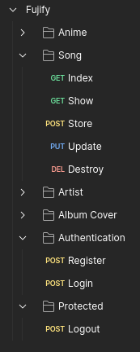

# REST API - Fujify
Cette API REST a été codée avec Laravel 10. On peut y retrouver les différents éléments vus en cours :
- Models - voir PR Controllers
- Controllers : [pt1](https://github.com/MoustaphaCamara/suivi_projet_2024_Fujify/pull/1/files) - [pt2](https://github.com/MoustaphaCamara/suivi_projet_2024_Fujify/pull/2/files)
- Gestion d'utilisateurs : [register, login, authenticated routes avec token](https://github.com/MoustaphaCamara/suivi_projet_2024_Fujify/pull/6)
- Gestion d'erreurs dans les requêtes : [via Requests personnalisées avec validation de la data passée](https://github.com/MoustaphaCamara/suivi_projet_2024_Fujify/pull/4/files)
- Fake Data : [Seeders, Factories](https://github.com/MoustaphaCamara/suivi_projet_2024_Fujify/pull/3/files)
- CRUD (voir PR Controllers) : Create, Read, Update & Delete des différents Models créés
- Gestion de fichiers : [Ajout d'images dans le storage](https://github.com/MoustaphaCamara/suivi_projet_2024_Fujify/pull/5/files)
- [Cache]() - PR en cours

## Postman

[Lien vers la collection Postman](https://lunar-sunset-959508.postman.co/workspace/bsOft~6f6d8a7c-71d1-425f-9fc2-58ea6cf7af2e/collection/24000334-cf0b03c0-3269-4336-bebf-985c1937de15?action=share&creator=24000334&active-environment=24000334-77b67695-9f27-49ff-9043-40090206b5e5)

_aperçu des routes testables_

## Contributors

- **[Adelia Fathipour](https://github.com/SajedehAdelia)**
- **[Moustapha Camara](https://github.com/MoustaphaCamara)**

# Lancement du projet

Clôner le projet :

HTTPS : 
`https://github.com/MoustaphaCamara/suivi_projet_2024_Fujify.git`

SSH :
`git@github.com:MoustaphaCamara/suivi_projet_2024_Fujify.git`

Aller dans le dossier cloné 

`cd suivi_projet_2024_Fujify`

Installer les dépendances

`composer install`

Se créer un .env en local en copiant le .env.example : 

`cp .env.example .env`

Créer une clé artisan

`php artisan key:generate`

Migrer les tables vers la base de données :

`php artisan migrate`

Lancer le serveur :

`php artisan serve`

Afficher la view blade de welcome par Laravel (pour vérification uniquement) : `http://127.0.0.1:8000/`

